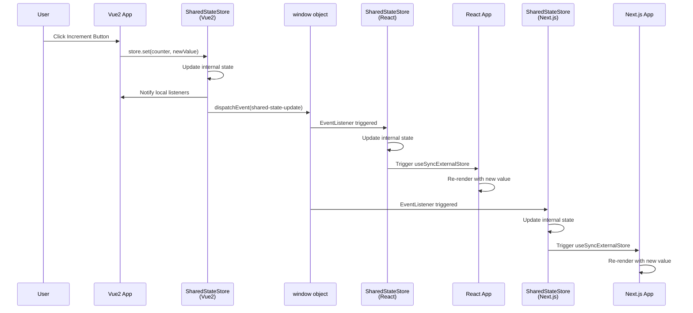

## 記事の内容

前回、[Shadow DOMでIslands Architectureっぽく(CSS編)](https://zenn.dev/chot/articles/shadow_dom_apps_css)という記事を記載しました。今回はShadow DOMにある複数のアプリ間での共有したい状態の管理方法について記載します。

## 動作環境

簡単なカウンターアプリを作ってみました。

https://igara.github.io/multi-fw-demo/nextjs/multi_counter.html


今回のアプリも[前回](https://zenn.dev/chot/articles/shadow_dom_apps_css#%E5%8B%95%E4%BD%9C%E7%92%B0%E5%A2%83)と同様で
Next.jsのSSGしたページをGitHub Pagesに公開し、ページ内にNext.js、Shadow DOM上にReactとVue2が動作しています。

## 解説

複雑な説明になるので図にしました。

### 状態共有の仕組み図

```mermaid
graph TB
    subgraph "Browser Window"
        Window["window object (グローバル)"]
        
        subgraph "ShadowRoot #1"
            Vue2["Vue2 Counter App"]
            VueStore["SharedStateStore インスタンス"]
            Vue2 -->|"store.set(counter, value)"| VueStore
            VueStore -->|"store.subscribe(counter, callback)"| Vue2
        end
        
        subgraph "ShadowRoot #2"
            React["React Counter App"]
            ReactStore["SharedStateStore インスタンス"]
            React -->|"useSharedState(counter)"| ReactStore
            ReactStore -->|"useSyncExternalStore"| React
        end
        
        subgraph "Light DOM"
            Next["Next.js (shadcn Counter)"]
            NextStore["SharedStateStore インスタンス"]
            Next -->|"useSharedState(counter)"| NextStore
            NextStore -->|"useSyncExternalStore"| Next
        end
        
        VueStore -->|"window.dispatchEvent(shared-state-update)"| Window
        ReactStore -->|"window.dispatchEvent(shared-state-update)"| Window
        NextStore -->|"window.dispatchEvent(shared-state-update)"| Window
        
        Window -->|"window.addEventListener(shared-state-update)"| VueStore
        Window -->|"window.addEventListener(shared-state-update)"| ReactStore
        Window -->|"window.addEventListener(shared-state-update)"| NextStore
    end

    style Window fill:#f9f,stroke:#333,stroke-width:4px
    style Vue2 fill:#42b883,stroke:#333,stroke-width:2px,text-decoration:underline
    style React fill:#61dafb,stroke:#333,stroke-width:2px,text-decoration:underline
    style Next fill:#000,stroke:#333,stroke-width:2px,color:#fff,text-decoration:underline
    style VueStore text-decoration:underline
    style ReactStore text-decoration:underline
    style NextStore text-decoration:underline

    click Vue2 href "https://github.com/igara/multi-fw-demo/blob/c57bfd4/packages/vue2/src/components/CounterApp.vue"
    click VueStore href "https://github.com/igara/multi-fw-demo/blob/c57bfd4/packages/shared-state/src/vue2.ts"
    click React href "https://github.com/igara/multi-fw-demo/blob/c57bfd4/packages/react/src/routes/multi_counter.tsx"
    click ReactStore href "https://github.com/igara/multi-fw-demo/blob/c57bfd4/packages/shared-state/src/react.ts"
    click Next href "https://github.com/igara/multi-fw-demo/blob/c57bfd4/packages/nextjs/app/multi_counter/components/ShadcnCounter.tsx"
    click NextStore href "https://github.com/igara/multi-fw-demo/blob/c57bfd4/packages/shared-state/src/react.ts"
```



上記の図でアンダーバーがあるテキスト箇所はリンクになっていますので、該当箇所を見ることができます。

今回は[@multi-fw-demo/shared-state](https://github.com/igara/multi-fw-demo/blob/c57bfd4/packages/shared-state)というCustomEventをPub/Subした状態管理ライブラリを作成しました。
CustomEventによるPub/Subの実装にした意図として複数アプリケーションで別々のビルドファイルを扱うものになるのでimportして使用するモジュールのリソースが別物になってしまうのでCustomEventに逃す意図があります。
[余談](#余談)によくある状態管理ライブラリとの違いを記載します。

この仕組みは株式会社カケハシさんの登壇した資料の[爆速でプロダクトをリリースしようと思ったらマイクロフロントエンドを選んでいた](https://speakerdeck.com/kakehashi/shipping-fast-with-micro-frontends)と被ったとサンプルのカウンターアプリを作った後で気づきました。

より実践的で戦略的な思想について
[型とテストで守るカスタムイベント通信 - 実プロダクトでの実装事例](https://kakehashi-dev.hatenablog.com/entry/2025/08/12/110000)
から色々学ぶことができました。

#### データフロー図

1. **ユーザーアクション**: いずれかのアプリ(Vue2/React/Next.js)でカウンターボタンをクリック
2. **ローカル更新**: そのアプリの`SharedStateStore`インスタンスが状態を更新
3. **グローバル通知**: `window.dispatchEvent()`でCustomEventを発火
4. **クロスコンテキスト同期**: すべてのShadowRoot内の`SharedStateStore`が`window.addEventListener()`でイベントを受信
5. **UI更新**: 各フレームワークの仕組み(Vue2のリアクティブシステム、ReactのuseSyncExternalStore)でUIが自動更新



## 余談

**状態管理ライブラリってただのPub/Subの実装やったんや**

漠然と状態管理の実装して、元々の状態管理どんな実装しているのか気になったというのと、前回のブログでもいっていたのですがどうしてもAstroがわいてきてChatGPTに相談してみました。

[ChatGPTに聞いてみたこと](https://chatgpt.com/share/692d1a39-caa0-8007-8816-1b7c855e0eff)


初手でnanostoresというワード出したのも[Astroのグローバルステートライブラリ推しっぽそう](https://docs.astro.build/ja/recipes/sharing-state-islands/)なので一番グローバルステートしてそう（どのアプリケーションでも使用できる意味合いで）という偏見で聞いてみました。

### よくある状態管理ライブラリのPub/Sub実装

```typescript:🟦 例：最もシンプルな Pub/Sub
const listeners = []

function subscribe(callback) {
  listeners.push(callback)
  return () => {
    const i = listeners.indexOf(callback)
    if (i !== -1) listeners.splice(i, 1)
  }
}

function publish(data) {
  listeners.forEach(cb => cb(data))
}
```

ChatGPTの例を見てなるほどとなり、今まで状態管理ライブラリのコードを読んだことなかったのですが、確かにこの形のものが多かったです。

- zustand
  https://github.com/pmndrs/zustand/blob/v5.0.9/src/react.ts#L30-L34
  React.[useSyncExternalStore](https://ja.react.dev/reference/react/useSyncExternalStore)と記載されている処理の前後見るとなるほどなと把握できました
- Nano Stores
  - [Pub/Sub部分](https://github.com/nanostores/nanostores/blob/1.1.0/atom/index.js)
    - listeners、subscribeという記載見てこれもPub/Sub実装なんだなと分かりました
  - Nano Stores React
    - [useSyncExternalStoreしてる部分](https://github.com/nanostores/react/blob/1.0.0/index.js)
      - React側はもうそうゆう実装なんだと思いました
  - Nano Stores Vue
    - [shallowRefしてる部分](https://github.com/nanostores/vue/blob/v0.10.0/use-store/index.js)
    Vue3というかVue Composition API以降をあまり知らなかったのですがreactivityによる仕組みでrefの更新で再更新をかける方式
      - 自前で作った[@multi-fw-demo/shared-state](https://github.com/igara/multi-fw-demo/blob/c57bfd4/packages/shared-state/src/vue2.ts)はVue2だったので別の発見がありました
        - Mixinによる状態変更でなんとかできてます


## 参考

- 株式会社カケハシさんより
  - [爆速でプロダクトをリリースしようと思ったらマイクロフロントエンドを選んでいた](https://speakerdeck.com/kakehashi/shipping-fast-with-micro-frontends)
  - [型とテストで守るカスタムイベント通信 - 実プロダクトでの実装事例](https://kakehashi-dev.hatenablog.com/entry/2025/08/12/110000)
